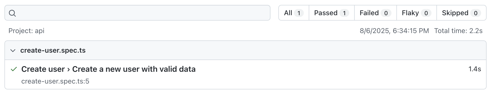
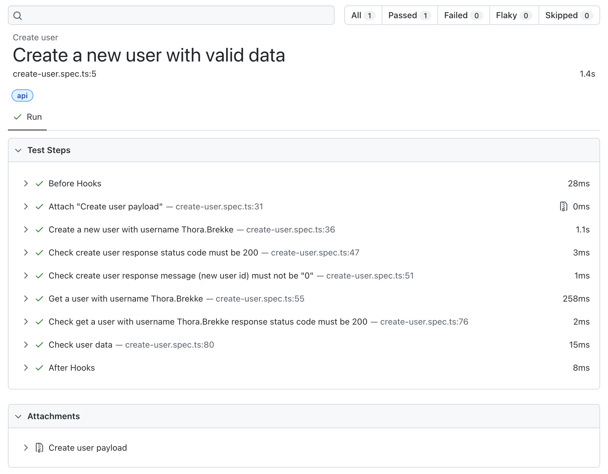

# UI-and-API-Tests-Assignment

สำหรับ Assignment 2 ทางผู้ได้รับแบบทดสอบเลือกทำแบบทดสอบที่ 1 Web UI Automation และแบบทดสอบที่ 2 API Automation โดยทั้ง 2 แบบทดสอบ ผู้ได้รับแบบทดสอบเลือกใช้ Playwright framework ในการดำเนินการทดสอบ มีรายละเอียดดังต่อไปนี้

## Table of Contents

1. [Pre-requisite](#pre-requisite)
2. [Installation](#installation)
3. [Assignment 2-1: Web UI Automation](#assignment-2-1-web-ui-automation)
4. [Assignment 2-2: API Automation](#assignment-2-2-api-automation)

## Pre-requisite

- [Node.js](https://nodejs.org/en/download)

## Installation

1. Clone GitHub repository นี้ ด้วยการรันคำสั่ง (หากไม่มีบัญชี GitHub สามารถดาวน์โหลดไฟล์ ZIP ได้)

```sh
git clone https://github.com/patarapong2629-wlb-biz/ui-and-api-tests-assignment.git
```

2. เปลี่ยน working directory เข้ามาภายในโฟลเดอร์ `ui-and-api-tests-assignment`

```sh
cd ui-and-api-tests-assignment
```

3. ติดตั้ง Packages เพื่อใช้ในการรันคำสั่งเพื่อดำเนินการทดสอบ

```sh
npm install
```

## Assignment 2-1: Web UI Automation

### โจทย์:

คุณได้รับมอบหมายให้สร้าง Test Automation Script สําหรับเว็บไซต์ demo ของ Sauce Labs (https://www.saucedemo.com/) โดยมีเงื่อนไขดังนี้:

    1. เขียน Test Case เพื่อล็อกอินเข้าสู่ระบบด้วย Username standard_user
    2. เมื่อล็อกอินสําเร็จ ให้เพิ่มสินค้าชื่อ "Sauce Labs Backpack" ลงในรถเข็น
    3. ไปยังหน้าตะกร้าสินค้า (Cart) และตรวจสอบว่าสินค้าที่เพิ่มไปปรากฏในรายการสินค้าอย่างถูกต้อง

### หมายเหตุ:

- ทดสอบใน Chrome Firefox และ Safari browser

### สิ่งที่ต้องส่งมอบ:

- Source code ของ Test Automation Framework และ Test Script<br>
  `สามารถดูได้ที่ไฟล์ add-product-to-cart.spec.ts ซึ่งอยู่ภายใต้โฟลเดอร์ ui-tests`
- คําแนะนําสั้นๆ เกี่ยวกับวิธีการรันสคริปต์<br>
  `รันโดยใช้คำสั่ง`
  ```sh
  npm run ui-tests
  ```
  `หลังรันเสร็จจะมีคำสั่งสำหรับการดู test report แสดงขึ้นมา สามารถรัน command ดังกล่าวเพื่อดู test report ได้`
- รายงานผลการทดสอบ (Test Report)<br>
  `ภาพรวมผลการดำเนินการทดสอบทั้ง 3 browsers`
  
  `รายละเอียดขั้นตอนการดำเนินการทดสอบ`
  

## Assignment 2-2: API Automation

### โจทย์:

คุณได้รับมอบหมายให้สร้าง Test Automation สําหรับการจัดการ User บน Public API ที่ https://petstore.swagger.io โดยมีเงื่อนไขดังนี้:

    1. ใช้ POST request ไปที่ endpoint /api/users เพื่อสร้าง User ใหม่
    2. ตรวจสอบว่า User ใหม่สร้างได้สําเร็จและถูกต้อง

### หมายเหตุ:

- เนื่องจากไม่มี endpoint /api/users จึงทำการทดสอบที่ endpoint /v2/user ในการสร้าง User ตาม https://petstore.swagger.io
- เนื่องจาก endpoint /v2/user ไม่มีการคืนข้อมูล User กลับ จึงดึงข้อมูล User ด้วย endpoint /v2/user/{username} เพื่อตรวจสอบความถูกต้องของข้อมูล
- จากการทดสอบ endpoint /v2/user/{username} หากมี username ซ้ำกันมากกว่า 1 user มีโอกาสที่ API จะ return ข้อมูลของ user ใด user หนึ่ง จึงเลือกใช้วิธีการ generate ข้อมูล user ใหม่ทุกครั้งในการดำเนินการทดสอบ

### สิ่งที่ต้องส่งมอบ:

- Source code ของสคริปต์ที่รัน Test Case ทั้งหมด<br>
  `สามารถดูได้ที่ไฟล์ create-user.spec.ts ซึ่งอยู่ภายใต้โฟลเดอร์ api-tests`
- คําแนะนําสั้นๆ เกี่ยวกับวิธีการรันสคริปต์<br>
  `รันโดยใช้คำสั่ง`
  ```sh
  npm run api-tests
  ```
  `หลังรันเสร็จจะมีคำสั่งสำหรับการดู test report แสดงขึ้นมา สามารถรัน command ดังกล่าวเพื่อดู test report ได้`
- (ไม่บังคับ) รายงานผลการทดสอบ (Test Report) ที่อ่านง่าย<br>
  `ภาพรวมผลการดำเนินการทดสอบ`
  
  `รายละเอียดขั้นตอนการดำเนินการทดสอบ`
  
